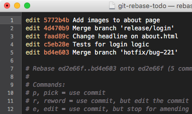

# Awesome engineer
A curated list of software engineering tips and tools

## Git

### Interactive rebase
Interactive Rebase is the Swiss Army Knife of tools in Git: it allows you to do and change almost anything.

The first step is to identify the last "good" commit and provide its hash to the rebase command:
`$ git rebase -i -p 0ad14fa5`

Your editor will open, requesting you to mark all the commits you want to change with the "edit" keyword.


Git will now walk you through each commit, giving you the chance to mold it as you desire:
```
Stopped at 5772b4bf2... Add images to about page
You can amend the commit now, with

    git commit --amend

Once you are satisfied with your changes, run

    git rebase --continue
``` 

<sub>Source: https://www.git-tower.com/learn/git/faq/change-author-name-email/</sub>


## Github

#### Github SSH setup
- Create the directory `~/.ssh`
- Copy and paste your PRIVATE SSH key into a file called `~/ssh/id_rsa`
